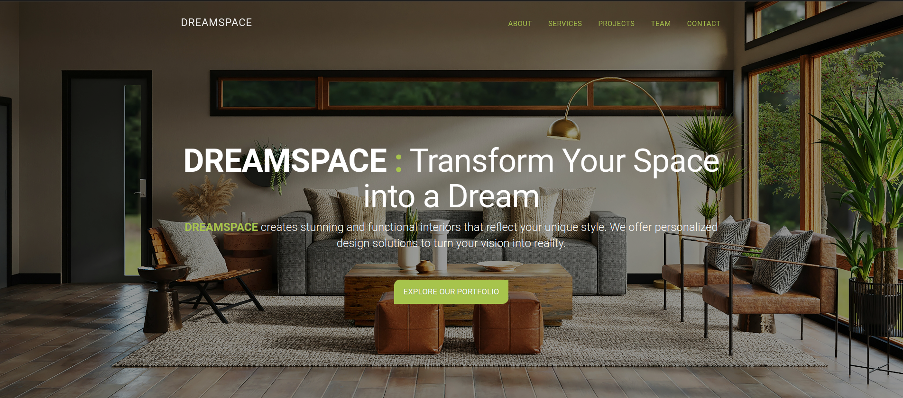

# DREAMSPACE

Interior design agency project created using Html, Css, Bootstrap and Javascript.

## Screenshots

## Acknowledgements

 - [Julian Stan](https://julianstan.com)
 - [ThemeWagon](https://themewagon.com)
 - [TemplateWire](https://templatewire.com)

 ## Credits

 - Bootstrap
 - Nivo Lightbox
 - Font Awesome
 - Unsplash

 ## Photos by:

 - Spacejoy on Unsplash
 - Maranda Vandergriff on Unsplash
 - Jason Wang on Unsplash
 - Uneebo Office Design on Unsplash

 ## Authors

- [@iulianSta](https://www.github.com/iulianSta)

## Demo

[DREAMSPACE](https://iuliansta.github.io/interior-design/)

## License

- [MIT](https://choosealicense.com/licenses/mit/)
- [CC BY 3.0](https://creativecommons.org/licenses/by/3.0/deed.en)